# Vue3 Persona5 UI
<p align="center">
  
</p>  
This project is still under development~

# Preview
<p align="center">
  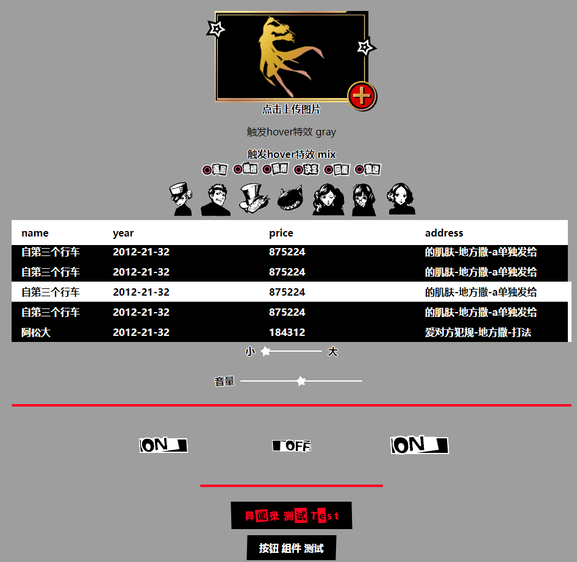
</p>  

# Simple Usage
## Download
```
npm install p5-ui
```
## Full Import
```
// In main.js
import { createApp } from 'vue'
import App from './App.vue'

import P5UI from 'p5-ui'
import 'p5-ui/dist/style.css'

const app = createApp(App)
app.use(P5UI)
app.mount('#app')
```
## On-demand Import
```
// In main.js
import { createApp } from 'vue'
import App from './App.vue'

import {P5Button, P5Switch} from 'p5-ui'
import 'p5-ui/dist/style.css'

const app = createApp(App)
app.component(P5Button.name, P5Button)
app.component(P5Switch.name, P5Switch)
app.mount('#app')
```

# Document
由于懒得再续费文档网站的服务器了，组件文档就以截图的形式放下面了。
examples文件夹里有文档网站的源码(examples/document-web)，npm install 后可直接npm run dev运行。  
打包后的文档网页(examples/document-web/build, 可直接在本地打开)
### 全局css
<p align="center">
  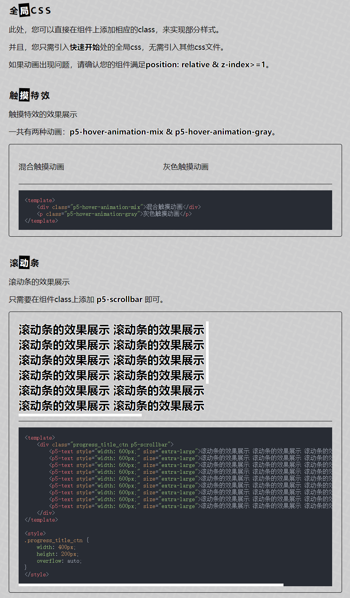
</p> 

### 图标
<p align="center">
  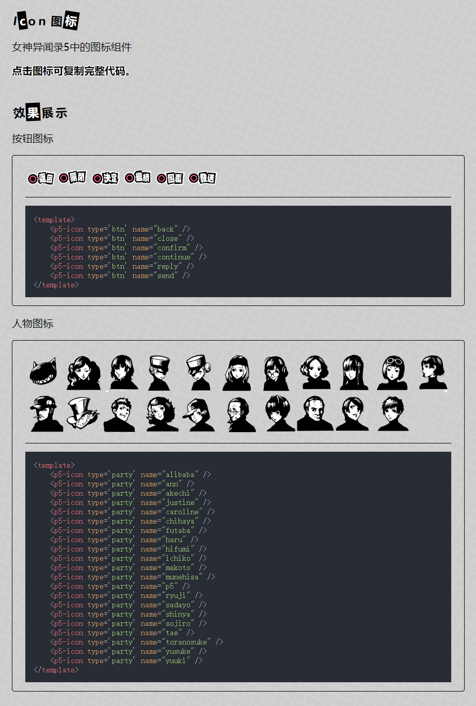
</p> 

### 标题
<p align="center">
  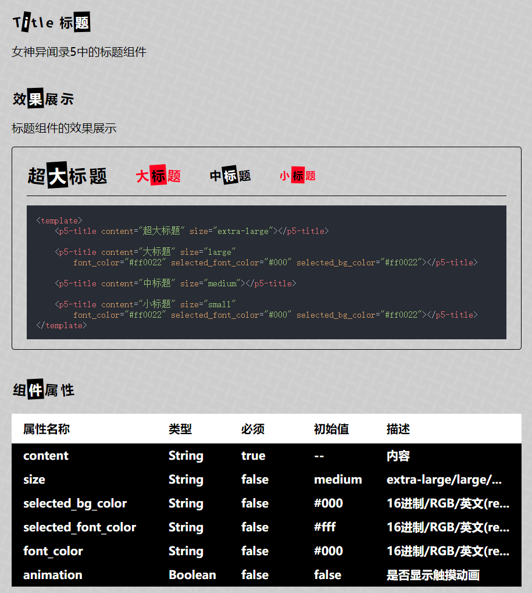
</p> 

### 文字
<p align="center">
  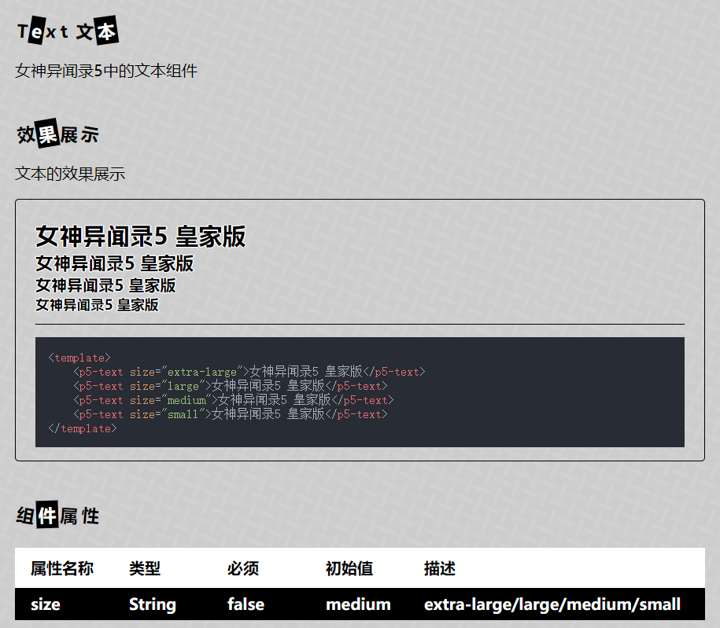
</p> 

### 滑块
<p align="center">
  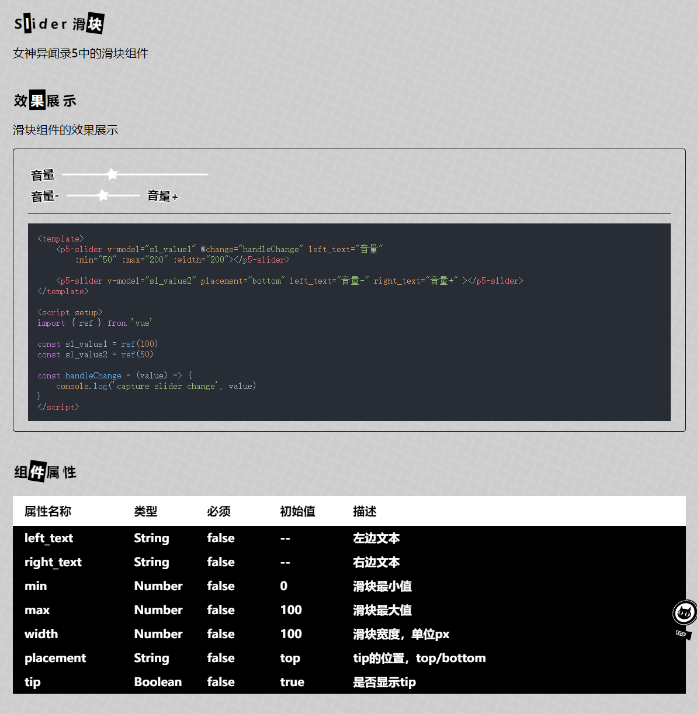
</p> 

### 开关
<p align="center">
  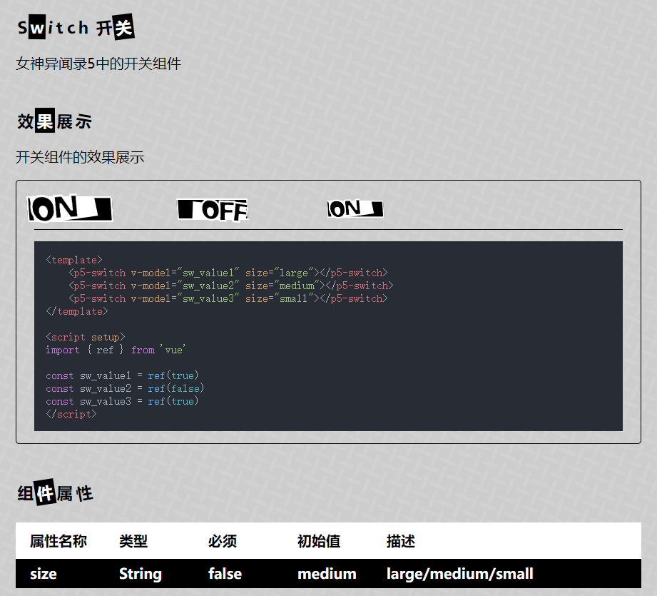
</p> 

### 消息
<p align="center">
  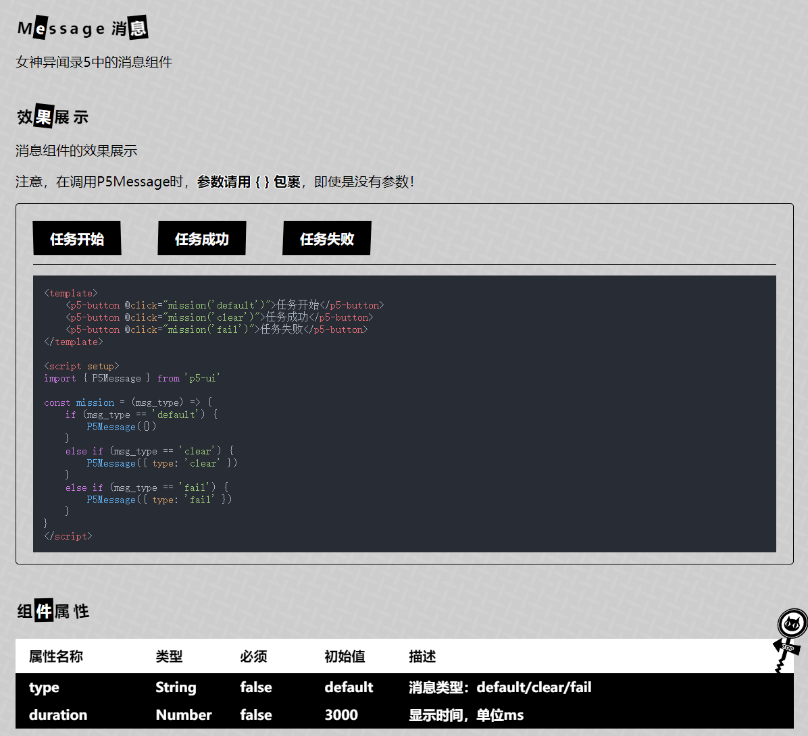
</p> 

### 提示
<p align="center">
  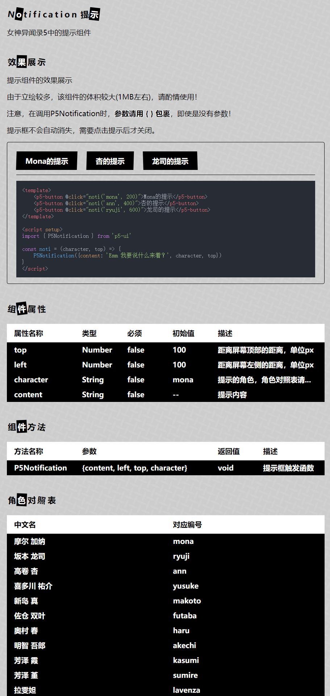
</p> 

### 返回顶部
<p align="center">
  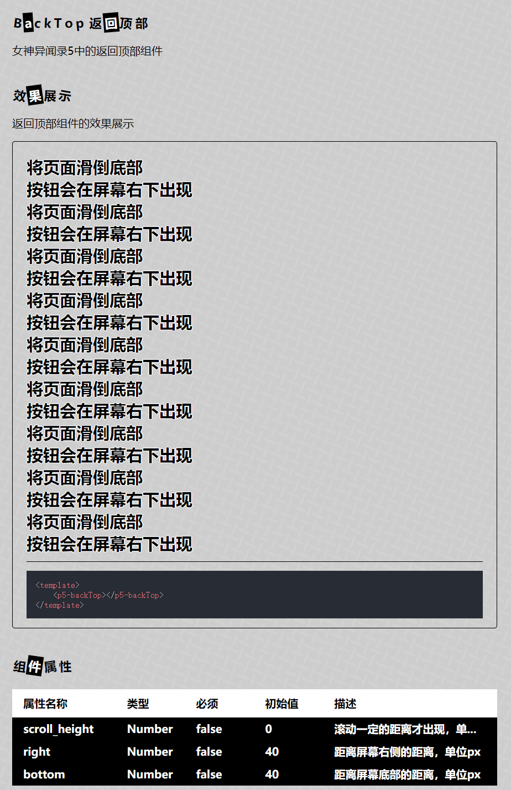
</p> 

### 分隔符
<p align="center">
  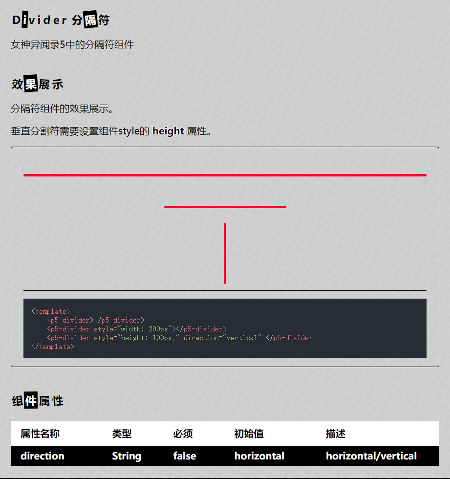
</p> 

### 上传
<p align="center">
  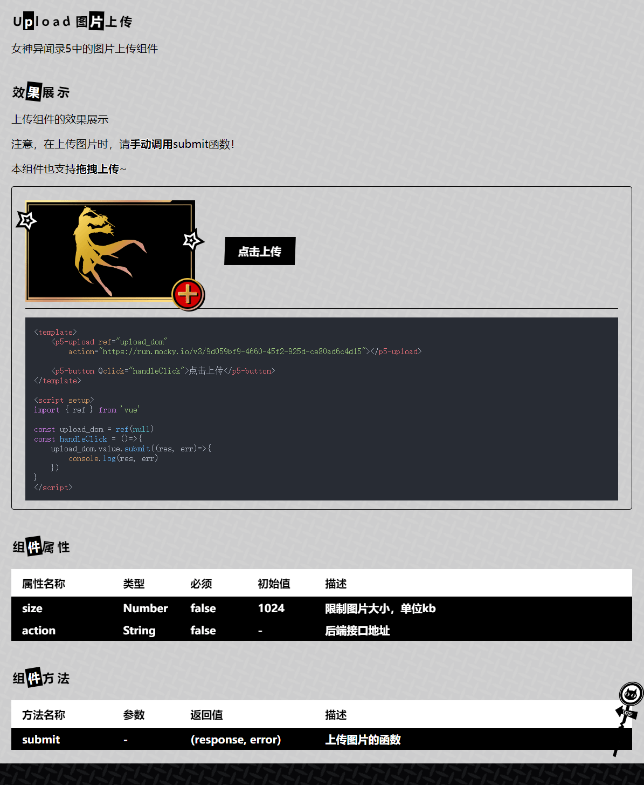
</p> 

### 动画
<p align="center">
  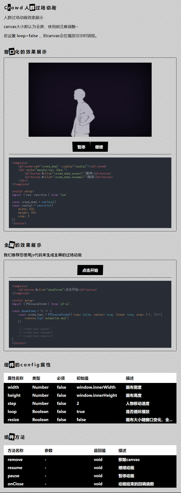
</p> 