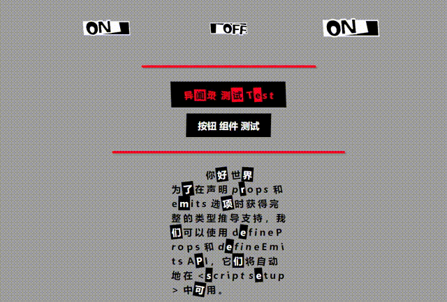

# Vue3 Persona5 UI
<p align="center">
  
</p>  
This project is still under development~

# Preview
<p align="center">
  
</p>  

# Simple Usage
## Download
```
npm install p5-ui
```
## Full Import
```
// In main.js
import { createApp } from 'vue'
import App from './App.vue'

import P5UI from 'p5-ui'
import 'p5-ui/dist/style.css'

const app = createApp(App)
app.use(P5UI)
app.mount('#app')
```
## On-demand Import
```
// In main.js
import { createApp } from 'vue'
import App from './App.vue'

import {P5Button, P5Switch} from 'p5-ui'
import 'p5-ui/dist/style.css'

const app = createApp(App)
app.component(P5Button.name, P5Button)
app.component(P5Switch.name, P5Switch)
app.mount('#app')
```

# Components
```
<template>
  <p5-title content="Hello World"
            :animation="true"
            font_color="#000"
            selected_bg_color="#000"
            selected_font_color="#fff"></p5-title>


  <p5-button>normal button</p5-button>

  <p5-divider></p5-divider>

  <p5-divider direction="vertical"></p5-divider>

  <p5-button>
    <p5-title content="Hello World"></p5-title>
  </p5-button>

  <p5-switch v-model="sw_value1" size="small"></p5-switch>
  <p5-switch v-model="sw_value2"></p5-switch>
  <p5-switch v-model="sw_value3" size="large"></p5-switch>
</template>

<script setup>
import { ref } from 'vue';

const sw_value1 = ref(true)
const sw_value2 = ref(true)
const sw_value3 = ref(false)
</script>
```


